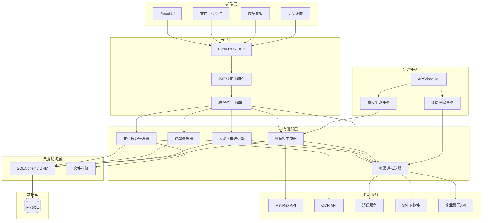
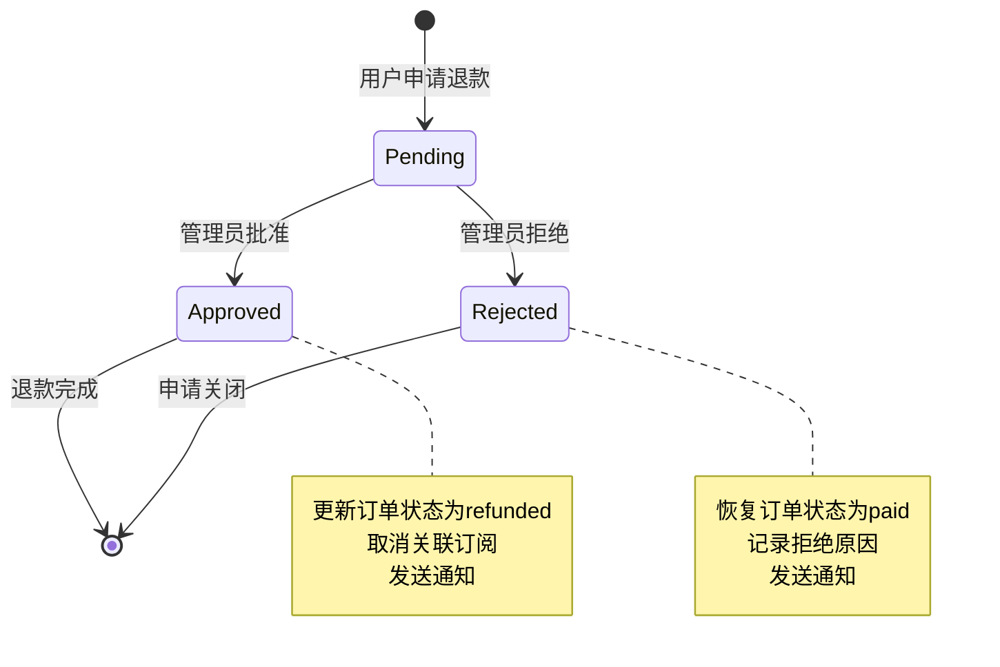
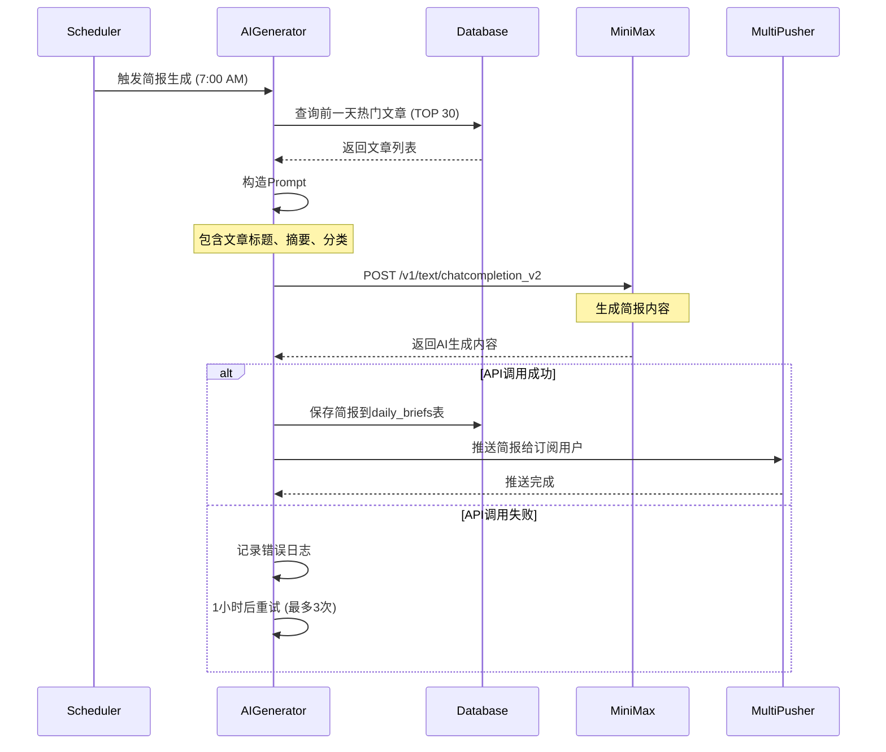

# 设计文档 - 订阅系统完善

## Overview

本设计文档描述了蒙小碳能源站订阅系统完善功能的技术实现方案。该系统基于Flask + SQLAlchemy + MySQL后端和React + TypeScript前端架构，旨在提供完整的订阅管理、支付凭证处理、退款流程、关键词定制推送、AI简报生成、权限控制和多渠道推送功能。

### 核心目标

1. **支付凭证管理**: 实现文件上传、存储、OCR识别和审核功能
2. **退款流程**: 建立完整的退款申请、审批和状态管理机制
3. **关键词推送**: 基于用户定制关键词的智能文章推送系统
4. **AI简报生成**: 集成MiniMax API生成每日行业简报
5. **权限控制**: 基于订阅等级的功能访问控制
6. **多渠道推送**: 支持企业微信、邮件、短信等多种推送渠道

### 技术栈

- **后端**: Flask 2.x, SQLAlchemy, MySQL 8.0, APScheduler
- **前端**: React 18, TypeScript, Ant Design
- **外部服务**: MiniMax API (AI生成), OCR API (凭证识别), 短信服务
- **存储**: 本地文件系统 (支付凭证)
- **定时任务**: APScheduler (简报生成、续费提醒)

## Architecture

### 系统架构图




### 架构设计原则

1. **分层架构**: 清晰的前端、API、业务逻辑、数据访问层分离
2. **模块化**: 每个功能模块独立封装，便于维护和测试
3. **可扩展性**: 支持新增推送渠道、支付方式等
4. **容错性**: 外部服务调用失败不影响核心功能
5. **安全性**: 文件上传验证、权限控制、敏感信息加密

## Components and Interfaces

### 1. 支付凭证管理器 (PaymentProofManager)

**职责**: 处理支付凭证的上传、存储、OCR识别和管理

**接口**:

```python
class PaymentProofManager:
    def upload_proof(self, file: FileStorage, order_id: int) -> dict:
        """
        上传支付凭证
        
        Args:
            file: 上传的文件对象
            order_id: 订单ID
            
        Returns:
            {
                'success': bool,
                'file_url': str,
                'ocr_result': dict  # 可选，OCR识别结果
            }
        """
        pass
    
    def validate_file(self, file: FileStorage) -> tuple[bool, str]:
        """
        验证文件格式和大小
        
        Returns:
            (is_valid, error_message)
        """
        pass
    
    def extract_payment_info(self, file_path: str) -> dict:
        """
        使用OCR提取支付信息
        
        Returns:
            {
                'amount': float,
                'transaction_id': str,
                'timestamp': datetime,
                'confidence': float
            }
        """
        pass
    
    def get_proof_url(self, order_id: int) -> str:
        """获取支付凭证URL"""
        pass
```

**实现细节**:

- 文件存储路径: `uploads/payment_proofs/{year}/{month}/{order_id}_{timestamp}.{ext}`
- 支持格式: JPG, PNG, PDF
- 文件大小限制: 5MB
- OCR服务: 百度OCR API或腾讯云OCR API
- 安全措施: 文件名sanitization, MIME类型验证

### 2. 退款处理器 (RefundProcessor)

**职责**: 处理退款申请、审批和状态管理

**接口**:

```python
class RefundProcessor:
    def create_refund_application(self, order_id: int, user_id: int, reason: str) -> dict:
        """
        创建退款申请
        
        Returns:
            {
                'application_id': int,
                'status': str,
                'created_at': datetime
            }
        """
        pass
    
    def approve_refund(self, application_id: int, admin_id: int) -> bool:
        """批准退款"""
        pass
    
    def reject_refund(self, application_id: int, admin_id: int, reason: str) -> bool:
        """拒绝退款"""
        pass
    
    def get_pending_applications(self) -> list:
        """获取待处理的退款申请"""
        pass
    
    def notify_user(self, application_id: int, status: str) -> bool:
        """通知用户退款状态变更"""
        pass
```

**状态机设计**:



### 3. 关键词推送引擎 (KeywordPushEngine)

**职责**: 基于用户关键词匹配文章并推送

**接口**:

```python
class KeywordPushEngine:
    def match_articles(self, keywords: list[str], articles: list[Article]) -> list[Article]:
        """
        匹配文章
        
        Args:
            keywords: 用户关键词列表
            articles: 待匹配的文章列表
            
        Returns:
            匹配的文章列表（按相关度排序）
        """
        pass
    
    def calculate_relevance_score(self, article: Article, keywords: list[str]) -> float:
        """
        计算文章与关键词的相关度分数
        
        Returns:
            0.0 - 1.0 的相关度分数
        """
        pass
    
    def push_matched_articles(self, user_id: int) -> dict:
        """
        推送匹配的文章给用户
        
        Returns:
            {
                'matched_count': int,
                'pushed_count': int,
                'status': str
            }
        """
        pass
```

**关键词匹配算法**:

1. **精确匹配**: 关键词完全出现在标题、摘要或标签中
2. **模糊匹配**: 使用分词和相似度计算
3. **权重计算**:
   - 标题匹配: 权重 3.0
   - 摘要匹配: 权重 2.0
   - 标签匹配: 权重 1.5
   - 内容匹配: 权重 1.0
4. **相关度分数**: `score = Σ(match_weight * keyword_weight) / total_keywords`
5. **排序**: 按相关度分数降序，相同分数按发布时间降序

**示例代码**:

```python
def calculate_relevance_score(self, article: Article, keywords: list[str]) -> float:
    score = 0.0
    matched_keywords = 0
    
    for keyword in keywords:
        # 标题匹配
        if keyword in article.title:
            score += 3.0
            matched_keywords += 1
        # 摘要匹配
        elif article.summary and keyword in article.summary:
            score += 2.0
            matched_keywords += 1
        # 标签匹配
        elif article.tags and any(keyword in tag for tag in article.tags):
            score += 1.5
            matched_keywords += 1
        # 内容匹配（模糊）
        elif article.content and self._fuzzy_match(keyword, article.content):
            score += 1.0
            matched_keywords += 1
    
    # 归一化分数
    if matched_keywords > 0:
        return score / len(keywords)
    return 0.0

def _fuzzy_match(self, keyword: str, text: str) -> bool:
    """使用jieba分词进行模糊匹配"""
    import jieba
    words = jieba.cut(text)
    return keyword in words or any(keyword in word for word in words)
```

### 4. AI简报生成器 (AIBriefGenerator)

**职责**: 调用MiniMax API生成每日简报

**接口**:

```python
class AIBriefGenerator:
    def generate_daily_brief(self, date: datetime.date) -> dict:
        """
        生成每日简报
        
        Returns:
            {
                'brief_id': int,
                'content': dict,
                'ai_suggestion': str,
                'generated_at': datetime
            }
        """
        pass
    
    def collect_articles(self, date: datetime.date, limit: int = 30) -> list[Article]:
        """收集指定日期的热门文章"""
        pass
    
    def call_minimax_api(self, prompt: str) -> str:
        """调用MiniMax API"""
        pass
    
    def format_brief_content(self, articles: list[Article], ai_response: str) -> dict:
        """格式化简报内容"""
        pass
```

**MiniMax API调用流程**:



**Prompt模板**:

```python
BRIEF_PROMPT_TEMPLATE = """
你是一位资深的能源行业分析师。请根据以下文章生成一份专业的每日简报。

文章列表：
{articles_summary}

要求：
1. 总结行业热点（不超过300字）
2. 解读重要政策（不超过300字）
3. 分析市场趋势（不超过300字）
{decision_advice}

请用专业、简洁的语言撰写，总字数控制在1000字以内。
"""

DECISION_ADVICE_TEMPLATE = """
4. 提供决策建议（不超过100字，仅针对高级版用户）
"""
```

### 5. 权限控制中间件 (PermissionController)

**职责**: 基于订阅等级控制功能访问权限

**接口**:

```python
class PermissionController:
    def check_permission(self, user_id: int, feature: str) -> bool:
        """
        检查用户是否有权限访问指定功能
        
        Args:
            user_id: 用户ID
            feature: 功能标识 (如 'dashboard_advanced', 'keyword_push')
            
        Returns:
            是否有权限
        """
        pass
    
    def get_user_subscription_level(self, user_id: int) -> str:
        """
        获取用户订阅等级
        
        Returns:
            'free', 'standard', 'premium'
        """
        pass
    
    def get_available_features(self, subscription_level: str) -> list[str]:
        """获取订阅等级可用的功能列表"""
        pass
```

**权限矩阵**:

| 功能 | 免费版 | 标准版 | 高级版 |
|------|--------|--------|--------|
| 基础数据看板 | ✓ | ✓ | ✓ |
| 完整数据看板 | ✗ | ✓ | ✓ |
| 趋势分析 | ✗ | ✗ | ✓ |
| 企业微信推送 | ✓ | ✓ | ✓ |
| 邮件推送 | ✗ | ✓ | ✓ |
| 短信推送 | ✗ | ✗ | ✓ |
| 关键词定制 | ✗ | ✗ | ✓ |
| AI简报 | ✗ | ✓ | ✓ |
| AI决策建议 | ✗ | ✗ | ✓ |

**Flask装饰器实现**:

```python
from functools import wraps
from flask import jsonify
from flask_jwt_extended import get_jwt_identity

def require_subscription(min_level: str):
    """
    订阅等级装饰器
    
    Args:
        min_level: 最低订阅等级 ('free', 'standard', 'premium')
    """
    def decorator(f):
        @wraps(f)
        def decorated_function(*args, **kwargs):
            user_id = get_jwt_identity()
            controller = PermissionController()
            user_level = controller.get_user_subscription_level(user_id)
            
            level_hierarchy = {'free': 0, 'standard': 1, 'premium': 2}
            
            if level_hierarchy.get(user_level, -1) < level_hierarchy.get(min_level, 999):
                return jsonify({
                    'error': '权限不足',
                    'message': f'此功能需要{min_level}版本订阅',
                    'current_level': user_level,
                    'required_level': min_level
                }), 403
            
            return f(*args, **kwargs)
        return decorated_function
    return decorator

# 使用示例
@app.route('/api/dashboard/advanced')
@jwt_required()
@require_subscription('standard')
def get_advanced_dashboard():
    # 只有标准版及以上用户可访问
    pass
```

### 6. 多渠道推送器 (MultiChannelPusher)

**职责**: 统一管理多种推送渠道

**接口**:

```python
class MultiChannelPusher:
    def push(self, user_id: int, content: str, channels: list[str] = None) -> dict:
        """
        推送消息到多个渠道
        
        Args:
            user_id: 用户ID
            content: 推送内容
            channels: 推送渠道列表，None表示使用用户配置的所有渠道
            
        Returns:
            {
                'wechat': {'success': bool, 'message': str},
                'email': {'success': bool, 'message': str},
                'sms': {'success': bool, 'message': str}
            }
        """
        pass
    
    def push_batch(self, user_ids: list[int], content: str) -> dict:
        """批量推送"""
        pass
    
    def get_user_channels(self, user_id: int) -> list[str]:
        """获取用户配置的推送渠道"""
        pass
```

**推送渠道实现**:

1. **企业微信推送** (已实现):
   - 使用现有的 `WeChatWorkPushService`
   - 支持文本、Markdown、卡片消息

2. **邮件推送** (新增):

```python
class EmailPushService:
    def __init__(self, smtp_server: str, smtp_port: int, username: str, password: str):
        self.smtp_server = smtp_server
        self.smtp_port = smtp_port
        self.username = username
        self.password = password
    
    def send(self, to_email: str, subject: str, content: str, html: bool = True) -> bool:
        """发送邮件"""
        import smtplib
        from email.mime.text import MIMEText
        from email.mime.multipart import MIMEMultipart
        
        try:
            msg = MIMEMultipart('alternative')
            msg['Subject'] = subject
            msg['From'] = self.username
            msg['To'] = to_email
            
            if html:
                part = MIMEText(content, 'html', 'utf-8')
            else:
                part = MIMEText(content, 'plain', 'utf-8')
            
            msg.attach(part)
            
            with smtplib.SMTP(self.smtp_server, self.smtp_port) as server:
                server.starttls()
                server.login(self.username, self.password)
                server.send_message(msg)
            
            return True
        except Exception as e:
            logger.error(f"邮件发送失败: {e}")
            return False
```

3. **短信推送** (新增):

```python
class SMSPushService:
    def __init__(self, provider: str, api_key: str, api_secret: str):
        self.provider = provider  # 'aliyun' or 'tencent'
        self.api_key = api_key
        self.api_secret = api_secret
    
    def send(self, phone: str, content: str, template_id: str = None) -> bool:
        """发送短信"""
        if self.provider == 'aliyun':
            return self._send_aliyun(phone, content, template_id)
        elif self.provider == 'tencent':
            return self._send_tencent(phone, content, template_id)
        else:
            raise ValueError(f"不支持的短信服务商: {self.provider}")
    
    def _send_aliyun(self, phone: str, content: str, template_id: str) -> bool:
        """阿里云短信"""
        # 实现阿里云短信API调用
        pass
    
    def _send_tencent(self, phone: str, content: str, template_id: str) -> bool:
        """腾讯云短信"""
        # 实现腾讯云短信API调用
        pass
```

**推送策略**:

- **并行推送**: 多个渠道同时发送，互不影响
- **失败重试**: 每个渠道独立重试，最多3次
- **降级策略**: 某渠道失败不影响其他渠道
- **日志记录**: 记录每个渠道的推送状态到 `broadcast_logs` 表

## Data Models

### 数据库表结构扩展

#### 1. Order 表扩展

```sql
ALTER TABLE orders ADD COLUMN payment_info JSON COMMENT 'OCR提取的支付信息';
ALTER TABLE orders ADD COLUMN refund_reason TEXT COMMENT '退款原因';
ALTER TABLE orders ADD COLUMN refund_status VARCHAR(20) COMMENT '退款状态: null, pending, approved, rejected';
ALTER TABLE orders ADD COLUMN refund_applied_at DATETIME COMMENT '退款申请时间';
ALTER TABLE orders ADD COLUMN refund_processed_at DATETIME COMMENT '退款处理时间';
ALTER TABLE orders ADD COLUMN refund_processed_by INT COMMENT '退款处理人ID';
ALTER TABLE orders ADD INDEX idx_refund_status (refund_status);
ALTER TABLE orders ADD INDEX idx_refund_applied_at (refund_applied_at);
```

**payment_info JSON结构**:

```json
{
  "amount": 299.00,
  "transaction_id": "2024011234567890",
  "timestamp": "2024-01-15T10:30:00",
  "confidence": 0.95,
  "ocr_provider": "baidu",
  "extracted_at": "2024-01-15T10:31:00"
}
```

#### 2. Subscription 表字段说明

```sql
-- push_channels JSON结构
{
  "enterprise_wechat": "user_wechat_id",
  "email": "user@example.com",
  "sms": "13800138000"
}

-- custom_keywords JSON结构
["光伏", "风电", "储能", "碳中和"]

-- push_time 格式
"08:00,12:00,18:00"
```

#### 3. 新增 RefundApplication 表

```sql
CREATE TABLE refund_applications (
    id INT PRIMARY KEY AUTO_INCREMENT,
    order_id INT NOT NULL,
    user_id INT NOT NULL,
    reason TEXT NOT NULL COMMENT '退款原因',
    status VARCHAR(20) NOT NULL DEFAULT 'pending' COMMENT '状态: pending, approved, rejected',
    applied_at DATETIME NOT NULL DEFAULT CURRENT_TIMESTAMP COMMENT '申请时间',
    processed_by INT COMMENT '处理人ID',
    processed_at DATETIME COMMENT '处理时间',
    reject_reason TEXT COMMENT '拒绝原因',
    created_at DATETIME NOT NULL DEFAULT CURRENT_TIMESTAMP,
    
    FOREIGN KEY (order_id) REFERENCES orders(id),
    FOREIGN KEY (user_id) REFERENCES users(id),
    FOREIGN KEY (processed_by) REFERENCES users(id),
    
    INDEX idx_order_id (order_id),
    INDEX idx_user_id (user_id),
    INDEX idx_status (status),
    INDEX idx_applied_at (applied_at)
) ENGINE=InnoDB DEFAULT CHARSET=utf8mb4 COMMENT='退款申请表';
```

**SQLAlchemy模型**:

```python
class RefundApplication(db.Model):
    __tablename__ = 'refund_applications'
    
    id = db.Column(db.Integer, primary_key=True)
    order_id = db.Column(db.Integer, db.ForeignKey('orders.id'), nullable=False)
    user_id = db.Column(db.Integer, db.ForeignKey('users.id'), nullable=False)
    reason = db.Column(db.Text, nullable=False)
    status = db.Column(db.String(20), default='pending', nullable=False)
    applied_at = db.Column(db.DateTime, default=datetime.utcnow, nullable=False)
    processed_by = db.Column(db.Integer, db.ForeignKey('users.id'))
    processed_at = db.Column(db.DateTime)
    reject_reason = db.Column(db.Text)
    created_at = db.Column(db.DateTime, default=datetime.utcnow, nullable=False)
    
    order = db.relationship('Order', backref='refund_applications')
    user = db.relationship('User', foreign_keys=[user_id], backref='refund_applications')
    processor = db.relationship('User', foreign_keys=[processed_by])
```

#### 4. DailyBrief 表字段说明

```sql
-- content JSON结构
{
  "ndrc": [
    {"title": "...", "summary": "...", "url": "..."},
    ...
  ],
  "coal": [...],
  "power": [...],
  "new_energy": [...]
}

-- ai_suggestion 示例
"根据今日政策动态，建议关注光伏产业链上游硅料价格走势，预计未来一周将有所回落。"
```

### API端点设计

#### 支付凭证相关

```
POST   /api/orders/{order_id}/payment-proof    上传支付凭证
GET    /api/orders/{order_id}/payment-proof    获取支付凭证
DELETE /api/orders/{order_id}/payment-proof    删除支付凭证
```

#### 退款相关

```
POST   /api/refunds                            创建退款申请
GET    /api/refunds                            获取退款申请列表
GET    /api/refunds/{id}                       获取退款申请详情
PUT    /api/refunds/{id}/approve               批准退款
PUT    /api/refunds/{id}/reject                拒绝退款
```

#### 关键词推送相关

```
GET    /api/subscriptions/keywords             获取用户关键词
PUT    /api/subscriptions/keywords             更新用户关键词
POST   /api/subscriptions/test-keywords        测试关键词匹配
```

#### AI简报相关

```
GET    /api/briefs                             获取简报列表
GET    /api/briefs/{date}                      获取指定日期简报
POST   /api/admin/briefs/generate              手动生成简报
```

#### 推送设置相关

```
GET    /api/subscriptions/push-settings        获取推送设置
PUT    /api/subscriptions/push-settings        更新推送设置
POST   /api/subscriptions/test-push            测试推送
```

#### 权限相关

```
GET    /api/permissions/features               获取可用功能列表
GET    /api/permissions/check/{feature}        检查功能权限
```

### API请求/响应示例

#### 上传支付凭证

**请求**:
```http
POST /api/orders/123/payment-proof
Content-Type: multipart/form-data

file: [binary data]
```

**响应**:
```json
{
  "success": true,
  "data": {
    "file_url": "/uploads/payment_proofs/2024/01/123_1705305600.jpg",
    "ocr_result": {
      "amount": 299.00,
      "transaction_id": "2024011234567890",
      "timestamp": "2024-01-15T10:30:00",
      "confidence": 0.95
    }
  },
  "message": "支付凭证上传成功"
}
```

#### 创建退款申请

**请求**:
```http
POST /api/refunds
Content-Type: application/json

{
  "order_id": 123,
  "reason": "服务不符合预期，申请退款"
}
```

**响应**:
```json
{
  "success": true,
  "data": {
    "application_id": 456,
    "status": "pending",
    "applied_at": "2024-01-15T14:30:00"
  },
  "message": "退款申请已提交，等待管理员审核"
}
```

#### 更新关键词

**请求**:
```http
PUT /api/subscriptions/keywords
Content-Type: application/json

{
  "keywords": ["光伏", "风电", "储能", "碳中和", "氢能"]
}
```

**响应**:
```json
{
  "success": true,
  "data": {
    "keywords": ["光伏", "风电", "储能", "碳中和", "氢能"],
    "count": 5,
    "max_allowed": 20
  },
  "message": "关键词更新成功"
}
```

#### 更新推送设置

**请求**:
```http
PUT /api/subscriptions/push-settings
Content-Type: application/json

{
  "channels": {
    "enterprise_wechat": true,
    "email": "user@example.com",
    "sms": "13800138000"
  },
  "push_time": ["08:00", "18:00"]
}
```

**响应**:
```json
{
  "success": true,
  "data": {
    "channels": {
      "enterprise_wechat": true,
      "email": "user@example.com",
      "sms": "13800138000"
    },
    "push_time": ["08:00", "18:00"],
    "subscription_level": "premium"
  },
  "message": "推送设置更新成功"
}
```


## Correctness Properties

*A property is a characteristic or behavior that should hold true across all valid executions of a system-essentially, a formal statement about what the system should do. Properties serve as the bridge between human-readable specifications and machine-verifiable correctness guarantees.*

本系统包含多个适合属性测试的核心业务逻辑，包括退款状态机、关键词匹配算法、权限控制、续费提醒时机计算和统计计算等。以下属性定义了这些逻辑应该满足的通用规则。

### Property 1: 退款状态机转换正确性

*For any* 订单和退款申请，状态转换应该遵循以下规则：
- 当订单状态为 `paid` 且创建退款申请时，订单状态应转换为 `refund_pending`
- 当退款申请状态为 `pending` 且管理员批准时，订单状态应转换为 `refunded`，关联订阅状态应转换为 `cancelled`
- 当退款申请状态为 `pending` 且管理员拒绝时，订单状态应恢复为 `paid`

**Validates: Requirements 2.4, 2.7, 2.8**

### Property 2: 关键词匹配正确性

*For any* 文章和关键词列表，关键词匹配算法应该满足：
- 如果关键词完全出现在文章标题中，该文章应该被匹配
- 如果关键词出现在文章摘要中，该文章应该被匹配
- 如果关键词出现在文章标签中，该文章应该被匹配
- 模糊匹配应该能识别包含关键词的词语（如"光伏"匹配"光伏发电"）
- 相关度分数应该在 0.0 到 1.0 之间
- 标题匹配的权重应该高于摘要匹配，摘要匹配的权重应该高于标签匹配

**Validates: Requirements 3.3, 3.5**

### Property 3: 文章排序和截断正确性

*For any* 匹配的文章列表，当文章数量超过50篇时：
- 排序后的文章应该按相关度分数降序排列
- 相同相关度分数的文章应该按发布时间降序排列
- 返回的文章数量应该恰好为50篇（如果匹配数量≥50）或实际匹配数量（如果<50）
- 返回的文章应该是相关度最高的前50篇

**Validates: Requirements 3.9**

### Property 4: 权限控制正确性

*For any* 用户和功能，权限控制应该满足：
- 免费版用户只能访问免费版功能
- 标准版用户可以访问免费版和标准版功能
- 高级版用户可以访问所有功能
- 当用户订阅等级升级时，权限应该立即扩展
- 当用户订阅等级降级时，权限应该立即收缩
- 当用户尝试访问超出其等级的功能时，应该返回权限不足错误

**Validates: Requirements 5.1, 5.5, 5.7**

### Property 5: 推送渠道错误隔离

*For any* 推送任务和渠道列表，当某个渠道失败时：
- 其他渠道的推送应该继续执行
- 失败的渠道应该被记录到日志
- 成功的渠道应该返回成功状态
- 推送任务的整体状态应该反映部分成功的情况

**Validates: Requirements 6.7**

### Property 6: 短信内容截断正确性

*For any* 推送内容，当内容长度超过70字时：
- 短信应该包含内容的前67字加"..."
- 短信应该包含完整内容的链接
- 短信总长度不应超过70字（不包括链接）
- 当内容长度≤70字时，应该发送完整内容

**Validates: Requirements 6.13**

### Property 7: OCR金额不一致检测

*For any* OCR提取的金额和订单金额：
- 当两个金额不相等时（差值>0.01），应该触发警告
- 当两个金额相等时（差值≤0.01），不应该触发警告
- 警告信息应该包含OCR金额和订单金额
- 金额比较应该考虑浮点数精度问题

**Validates: Requirements 7.3**

### Property 8: 续费提醒时机正确性

*For any* 订阅和当前日期：
- 当订阅距离到期还有7天时，应该发送第一次提醒
- 当订阅距离到期还有3天时，应该发送第二次提醒
- 当订阅距离到期还有1天时，应该发送第三次提醒
- 当订阅距离到期还有其他天数时，不应该发送提醒
- 提醒时机的计算应该考虑时区（Asia/Shanghai）

**Validates: Requirements 8.2, 8.3, 8.4**

### Property 9: 自动续费不发送提醒

*For any* 订阅，当订阅开启了自动续费（auto_renew=True）时：
- 无论距离到期还有多少天，都不应该发送续费提醒
- 自动续费标志应该在订阅记录中正确存储
- 提醒检查逻辑应该优先检查自动续费标志

**Validates: Requirements 8.7**

### Property 10: 订阅到期状态更新

*For any* 订阅，当订阅的 end_date 小于当前时间时：
- 订阅状态应该从 `active` 更新为 `expired`
- 状态更新应该在每日检查任务中执行
- 已过期的订阅不应该再次更新状态

**Validates: Requirements 8.8**

### Property 11: 统计计算正确性

*For any* 订阅和订单数据集：
- 总订阅数 = 所有订阅记录的数量
- 活跃订阅数 = 状态为 `active` 且 end_date > 当前时间的订阅数量
- 即将到期订阅数 = 状态为 `active` 且 end_date 在未来7天内的订阅数量
- 本月新增订阅数 = created_at 在本月的订阅数量
- 总订单数 = 所有订单记录的数量
- 待审核订单数 = payment_status 为 `pending` 的订单数量
- 已完成订单数 = payment_status 为 `paid` 的订单数量
- 退款订单数 = payment_status 为 `refunded` 的订单数量
- 总收入 = 所有 payment_status 为 `paid` 的订单金额之和
- 本月收入 = payment_time 在本月且 payment_status 为 `paid` 的订单金额之和

**Validates: Requirements 9.2, 9.5, 9.6**

### Property 12: 时间范围过滤正确性

*For any* 数据集和时间范围（start_date, end_date）：
- 过滤后的数据应该只包含时间戳在 [start_date, end_date] 范围内的记录
- 边界值应该被包含（闭区间）
- 当 start_date > end_date 时，应该返回空结果或错误
- 当时间范围为 null 时，应该返回所有数据

**Validates: Requirements 9.7**

## Error Handling

### 文件上传错误处理

1. **文件格式错误**:
   - 检查: MIME类型验证和文件扩展名验证
   - 响应: `400 Bad Request`，错误信息："不支持的文件格式，仅支持JPG、PNG、PDF"
   - 日志: 记录用户ID、文件名、MIME类型

2. **文件大小超限**:
   - 检查: 文件大小 > 5MB
   - 响应: `413 Payload Too Large`，错误信息："文件大小超过5MB限制"
   - 日志: 记录用户ID、文件名、文件大小

3. **文件存储失败**:
   - 场景: 磁盘空间不足、权限问题
   - 响应: `500 Internal Server Error`，错误信息："文件上传失败，请稍后重试"
   - 日志: 记录详细错误堆栈
   - 恢复: 清理临时文件

4. **病毒扫描失败**:
   - 场景: 文件包含恶意代码
   - 响应: `400 Bad Request`，错误信息："文件安全检查未通过"
   - 日志: 记录用户ID、文件哈希值
   - 操作: 删除文件，标记用户

### OCR服务错误处理

1. **API调用失败**:
   - 场景: 网络超时、API限流、认证失败
   - 策略: 静默失败，不影响文件上传
   - 日志: 记录错误类型、响应码
   - 降级: 跳过OCR，允许手动输入

2. **识别置信度低**:
   - 场景: confidence < 0.7
   - 策略: 保存OCR结果但标记为低置信度
   - UI: 显示警告，建议管理员人工核对

3. **识别结果异常**:
   - 场景: 金额为负数、日期格式错误
   - 策略: 丢弃异常字段，保留其他字段
   - 日志: 记录异常值

### 退款流程错误处理

1. **订单状态不符**:
   - 检查: 订单状态不是 `paid`
   - 响应: `400 Bad Request`，错误信息："订单状态不允许申请退款"
   - 日志: 记录订单ID、当前状态

2. **重复申请**:
   - 检查: 订单已有pending状态的退款申请
   - 响应: `409 Conflict`，错误信息："该订单已有待处理的退款申请"
   - 日志: 记录订单ID、现有申请ID

3. **审批权限不足**:
   - 检查: 操作用户不是管理员
   - 响应: `403 Forbidden`，错误信息："无权限审批退款申请"
   - 日志: 记录用户ID、申请ID

4. **状态转换失败**:
   - 场景: 数据库更新失败
   - 策略: 事务回滚，保持原状态
   - 响应: `500 Internal Server Error`
   - 日志: 记录详细错误堆栈
   - 通知: 发送告警邮件给管理员

### MiniMax API错误处理

1. **API调用失败**:
   - 场景: 网络超时、API限流、认证失败
   - 策略: 重试机制（1小时后重试，最多3次）
   - 日志: 记录错误类型、重试次数
   - 通知: 第3次失败后发送告警

2. **生成内容超长**:
   - 场景: 返回内容 > 1000字
   - 策略: 截断到1000字
   - 日志: 记录原始长度

3. **生成内容质量差**:
   - 场景: 内容包含乱码、格式错误
   - 策略: 使用模板生成默认简报
   - 日志: 记录原始内容
   - 通知: 发送告警给管理员

### 推送服务错误处理

1. **企业微信推送失败**:
   - 场景: token过期、用户未绑定、API限流
   - 策略: 重试3次，间隔1分钟
   - 日志: 记录用户ID、错误码
   - 降级: 尝试其他渠道

2. **邮件发送失败**:
   - 场景: SMTP连接失败、邮箱地址无效
   - 策略: 重试3次，间隔5分钟
   - 日志: 记录邮箱地址、SMTP错误
   - 降级: 标记为失败，不影响其他渠道

3. **短信发送失败**:
   - 场景: 余额不足、手机号无效、运营商限流
   - 策略: 重试1次
   - 日志: 记录手机号、错误码
   - 通知: 余额不足时发送告警

4. **批量推送部分失败**:
   - 策略: 记录每个用户的推送状态
   - 日志: 记录成功数、失败数、失败用户列表
   - 报告: 生成推送报告供管理员查看

### 权限控制错误处理

1. **订阅已过期**:
   - 检查: end_date < 当前时间
   - 响应: `403 Forbidden`，错误信息："订阅已过期，请续费"
   - UI: 引导用户到续费页面

2. **订阅等级不足**:
   - 检查: 用户等级 < 功能要求等级
   - 响应: `403 Forbidden`，错误信息："此功能需要{等级}版本订阅"
   - UI: 显示升级引导

3. **未登录**:
   - 检查: JWT token缺失或无效
   - 响应: `401 Unauthorized`
   - UI: 重定向到登录页面

### 定时任务错误处理

1. **任务执行超时**:
   - 场景: 简报生成超过30秒
   - 策略: 终止任务，记录日志
   - 通知: 发送告警邮件

2. **任务执行失败**:
   - 策略: 记录错误日志，下次继续执行
   - 通知: 连续失败3次后发送告警

3. **并发执行冲突**:
   - 策略: 使用分布式锁（Redis）防止重复执行
   - 日志: 记录锁获取失败

### 数据库错误处理

1. **连接失败**:
   - 策略: 重试3次，间隔5秒
   - 响应: `503 Service Unavailable`
   - 通知: 发送告警邮件

2. **事务冲突**:
   - 场景: 并发更新同一订单
   - 策略: 乐观锁，重试
   - 日志: 记录冲突详情

3. **数据完整性错误**:
   - 场景: 外键约束、唯一约束违反
   - 响应: `400 Bad Request`，错误信息："数据验证失败"
   - 日志: 记录详细错误

## Testing Strategy

### 测试方法概述

本系统采用**双重测试策略**：
- **单元测试**: 验证具体示例、边界条件和错误处理
- **属性测试**: 验证核心业务逻辑的通用属性
- **集成测试**: 验证外部服务集成和端到端流程

### 属性测试 (Property-Based Testing)

**适用场景**: 核心业务逻辑，包括退款状态机、关键词匹配、权限控制、续费提醒、统计计算等

**测试库**: 使用 `pytest` + `hypothesis` (Python)

**配置要求**:
- 每个属性测试最少运行 **100次迭代**
- 使用 `@given` 装饰器生成随机测试数据
- 每个测试必须引用设计文档中的属性编号

**标签格式**:
```python
# Feature: subscription-enhancement, Property 1: 退款状态机转换正确性
@given(
    order_status=st.sampled_from(['paid', 'pending', 'cancelled']),
    refund_action=st.sampled_from(['create', 'approve', 'reject'])
)
@settings(max_examples=100)
def test_refund_state_machine(order_status, refund_action):
    # 测试实现
    pass
```

**属性测试实现示例**:

1. **Property 1: 退款状态机**

```python
from hypothesis import given, strategies as st, settings
import pytest

# Feature: subscription-enhancement, Property 1: 退款状态机转换正确性
@given(
    order_amount=st.floats(min_value=1.0, max_value=10000.0),
    user_id=st.integers(min_value=1, max_value=1000)
)
@settings(max_examples=100)
def test_refund_state_transitions(order_amount, user_id):
    """测试退款状态机的所有转换"""
    # 创建订单
    order = create_test_order(user_id, order_amount, status='paid')
    
    # 创建退款申请
    refund_app = refund_processor.create_refund_application(
        order.id, user_id, "测试退款"
    )
    
    # 验证订单状态转换为 refund_pending
    order = Order.query.get(order.id)
    assert order.payment_status == 'refund_pending'
    
    # 批准退款
    refund_processor.approve_refund(refund_app['application_id'], admin_id=1)
    
    # 验证订单状态转换为 refunded
    order = Order.query.get(order.id)
    assert order.payment_status == 'refunded'
    
    # 验证订阅状态转换为 cancelled
    subscription = Subscription.query.filter_by(user_id=user_id).first()
    assert subscription.status == 'cancelled'
```

2. **Property 2: 关键词匹配**

```python
# Feature: subscription-enhancement, Property 2: 关键词匹配正确性
@given(
    keywords=st.lists(st.text(min_size=1, max_size=10), min_size=1, max_size=20),
    title=st.text(min_size=10, max_size=100),
    summary=st.text(min_size=20, max_size=200)
)
@settings(max_examples=100)
def test_keyword_matching(keywords, title, summary):
    """测试关键词匹配算法"""
    engine = KeywordPushEngine()
    
    # 创建测试文章
    article = Article(
        title=title,
        summary=summary,
        tags=[]
    )
    
    # 计算相关度分数
    score = engine.calculate_relevance_score(article, keywords)
    
    # 验证分数范围
    assert 0.0 <= score <= 1.0
    
    # 如果关键词在标题中，分数应该 > 0
    if any(kw in title for kw in keywords):
        assert score > 0.0
    
    # 如果关键词在摘要中，分数应该 > 0
    if any(kw in summary for kw in keywords):
        assert score > 0.0
```

3. **Property 4: 权限控制**

```python
# Feature: subscription-enhancement, Property 4: 权限控制正确性
@given(
    subscription_level=st.sampled_from(['free', 'standard', 'premium']),
    feature=st.sampled_from([
        'dashboard_basic', 'dashboard_full', 'dashboard_trend',
        'push_wechat', 'push_email', 'push_sms',
        'keyword_custom', 'ai_brief', 'ai_advice'
    ])
)
@settings(max_examples=100)
def test_permission_control(subscription_level, feature):
    """测试权限控制逻辑"""
    controller = PermissionController()
    
    # 定义权限矩阵
    permission_matrix = {
        'free': ['dashboard_basic', 'push_wechat'],
        'standard': ['dashboard_basic', 'dashboard_full', 'push_wechat', 'push_email', 'ai_brief'],
        'premium': ['dashboard_basic', 'dashboard_full', 'dashboard_trend', 
                   'push_wechat', 'push_email', 'push_sms',
                   'keyword_custom', 'ai_brief', 'ai_advice']
    }
    
    # 创建测试用户
    user = create_test_user(subscription_level=subscription_level)
    
    # 检查权限
    has_permission = controller.check_permission(user.id, feature)
    
    # 验证权限正确性
    expected = feature in permission_matrix[subscription_level]
    assert has_permission == expected
```

### 单元测试 (Unit Tests)

**适用场景**: 具体功能、边界条件、错误处理

**测试覆盖**:

1. **文件上传验证**:
   - 测试支持的文件格式 (JPG, PNG, PDF)
   - 测试不支持的文件格式
   - 测试文件大小边界 (4.9MB, 5MB, 5.1MB)
   - 测试文件名sanitization

2. **OCR结果处理**:
   - 测试OCR成功场景
   - 测试OCR失败场景（静默失败）
   - 测试金额不一致警告
   - 测试低置信度处理

3. **推送渠道选择**:
   - 测试不同订阅等级的渠道限制
   - 测试邮箱格式验证
   - 测试手机号格式验证
   - 测试短信内容截断

4. **时间计算**:
   - 测试续费提醒时机（7天、3天、1天）
   - 测试订阅到期判断
   - 测试时区处理

### 集成测试 (Integration Tests)

**适用场景**: 外部服务集成、端到端流程

**测试覆盖**:

1. **MiniMax API集成**:
   - 测试API调用成功
   - 测试API调用失败和重试
   - 测试生成内容格式化
   - 使用mock避免实际API调用

2. **OCR API集成**:
   - 测试百度OCR API调用
   - 测试腾讯云OCR API调用
   - 测试API失败降级
   - 使用mock避免实际API调用

3. **推送服务集成**:
   - 测试企业微信推送
   - 测试邮件推送
   - 测试短信推送
   - 测试多渠道并行推送
   - 测试渠道失败隔离
   - 使用mock避免实际推送

4. **定时任务集成**:
   - 测试简报生成任务
   - 测试续费提醒任务
   - 测试任务调度
   - 测试任务失败恢复

5. **端到端流程**:
   - 测试完整的退款流程（申请→审批→通知）
   - 测试完整的关键词推送流程（设置→匹配→推送）
   - 测试完整的简报生成流程（收集→生成→推送）

### 测试数据生成

**Hypothesis策略**:

```python
# 订单数据生成
orders = st.builds(
    Order,
    order_no=st.text(min_size=10, max_size=20),
    amount=st.floats(min_value=1.0, max_value=10000.0),
    payment_status=st.sampled_from(['pending', 'paid', 'cancelled', 'refunded'])
)

# 文章数据生成
articles = st.builds(
    Article,
    title=st.text(min_size=10, max_size=100),
    summary=st.text(min_size=20, max_size=500),
    tags=st.lists(st.text(min_size=2, max_size=20), max_size=10),
    published_at=st.datetimes(
        min_value=datetime(2024, 1, 1),
        max_value=datetime(2024, 12, 31)
    )
)

# 关键词列表生成
keywords = st.lists(
    st.text(min_size=2, max_size=10, alphabet=st.characters(whitelist_categories=('L',))),
    min_size=1,
    max_size=20
)
```

### 测试执行

**命令**:
```bash
# 运行所有测试
pytest tests/

# 运行属性测试
pytest tests/property/ -v

# 运行单元测试
pytest tests/unit/ -v

# 运行集成测试
pytest tests/integration/ -v

# 生成覆盖率报告
pytest --cov=app --cov-report=html
```

**CI/CD集成**:
- 每次提交自动运行所有测试
- 属性测试失败时阻止合并
- 代码覆盖率要求 > 80%

### 测试环境

**数据库**: 使用SQLite内存数据库进行测试
**外部服务**: 使用pytest-mock进行mock
**定时任务**: 使用freezegun控制时间

